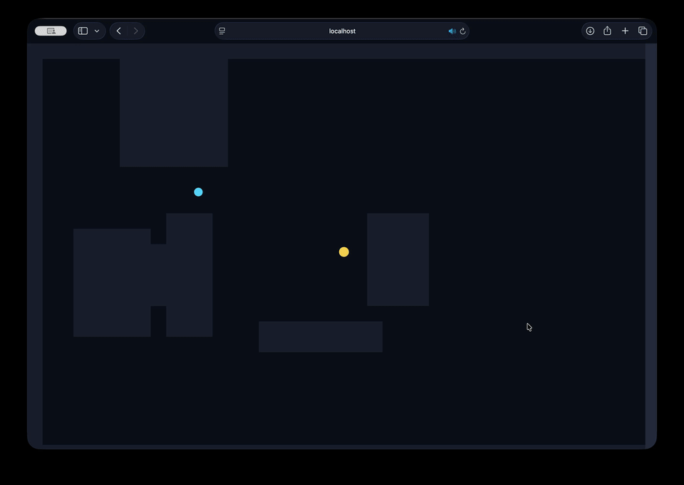

# Manhattan Loudness



A live demo is (or soon will be) served fresh from the sleigh at: `https://davidyen1124.github.io/manhattan-loudness/`

A tiny browser game where you chase a suspiciously cheerful “radio” through a procedurally-generated maze.
The closer you get, the louder it gets… using **Manhattan distance** (because in Manhattan, even your math refuses to move diagonally).

If you’ve ever thought “What if an audio mixer was also a dungeon crawler?”, congratulations: you have the exact kind of problem this repo solves.

## How to Play

- Click / tap the canvas to start audio (browsers require a user gesture; they’re fun at parties like that).
- Move with `WASD` or the arrow keys.
- Blue dot = you. Gold dot = the radio source.
- The right-side meter is your loudness bar. Red means “you found it”, green means “it’s somewhere… in Manhattan… probably”.

## Run It Locally

```bash
npm install
npm run dev
```

Then open the URL Vite prints (usually `http://localhost:5173`).

## What’s Actually Happening (Under The Tinsel)

- `src/App.tsx` renders everything on a single `<canvas>` (2D context).
- “Volume” is `1 - (|dx| + |dy|) / radius`, clamped to `[0, 1]`.
- Audio is Web Audio API: a looping “radio-ish” buffer goes through a `GainNode` that tracks your distance.
- The maze walls are randomly stamped rectangles, plus a safe-ish clearing around spawn + source.

## Controls & Tips

- If you hear nothing: click the canvas once. Browsers won’t autoplay sound, no matter how politely you ask.
- The meter is a lie in the best way: it’s honest, but it’s also judging you.

## Notes

- Not affiliated with New York City, its noise complaints, or any landlord who “didn’t hear anything.”
- PRs welcome, especially if they add pigeons, taxis, or a boss fight against a leaf blower.
